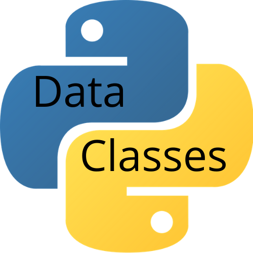
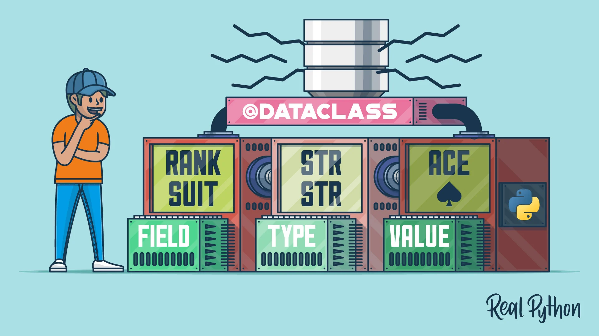

# THE DATACLASSES


*************************************************************************************

# **Table des matieres**
1.[Introduction](#introduction)  
2.[Presentation of the concept ](#presentation-of-the-concept)   
3.[Theory](#theory)  
4.[Pratical example](#pratical-example)  
a.[Example 1](#example-1)  
b.[Example 2](#example-2)  
c.[Example 3](#example-3)    
5.[Potentiel alternatives](#potentiel-alternatives)  
6.[Use case in data analysis](#use-case-in-data-analysis)  
7.[Conclusion](#Conclusion)  
8.[Ressource](#resources-consulted) 

## Introduction

Python Data Classes provide an intuitive way of building composite data types from simple components, much as classes are often used as the foundational building blocks of object-oriented programming. Built on top of the language's powerful typing system, data classes provide a straightforward way for developers to efficiently manipulate complex data. 

Since version 3.7, Python has introduced a very interesting new feature, known as dataclasses. This is a feature that aims to simplify the task of creating classes that only store data.

## Presentation of the concept  

Dataclasses are an extension of the popular object-oriented programming language. They are a particular approach to creating structured data types that are easy to work with, allowing developers to easily store, track and manipulate data. They also offer an extensible, reusable way to build the composite data structures necessary for advanced programming tasks. 

Data classes are classes that contain one or more elements that are collected and associated together in a data class. Each element is called a field and is defined by its type, name, and other optional parameters. The field definitions for a data class must also include an init signature that specifies the arguments used to initialize an object as a data class. 

Data classes allow developers to build powerful data structures without needing to write large amounts of code. They combine the best of object-oriented programming - inheritance, encapsulation, abstraction - and the increased flexibility and modularity of functional programming. 



## Theory
Dataclasses are based on Python's 'dataclasses' extension. These new data types are a subclass of the "object" class, with attributes and methods specific to an instance. Classes can contain various values such as strings, integers, lists etc.

Dataclasses are designed for use when you need to process data in an application. They are a quick and easy way to store information because they are very simple to create and use. Dataclasses can be defined using a specific @dataclass decorator on a class. Using this decorator, you can specify the type of fields and the default values.

The main use of dataclasses is to quickly and easily create classes with very simple structures. In addition to the built-in method of defining a dataclass with the @dataclass annotation, dataclasses can also be defined with the dataclass function. This function allows for the definition of a class which can be used to create instances of the class, and has the same syntax as using the @dataclass annotation. In both cases, dataclasses can be extended in the same way as regular classes.

Dataclasses take advantage of the fact that in Python, classes are defined as functions, meaning that dataclasses are objects that are actually functions and not classes. This allows for a great amount of flexibility and allows for the addition of methods, instance variables, and other features that are commonly used in other object-oriented languages.


## Pratical example 


### example 1
Here is a simple example of creating a DataClass:

python
from dataclasses import dataclass

# declaration of a dataclass called "Person"
```python
@dataclass
Person class:
    # definition of class attributes
    name: str
    age: int
``` 
# class instantiation
```python
person_1 = Person("John", 22)
```
# display of name and age values
```python
print(person_1.name)
print(person_1.age)
```

The code translates the following result:
```python
John
22
```
### Example 2
Here is an example dataclass for a Person class that stores information such as name, age, and date of birth:

```python
from dataclasses import dataclass

@dataclass
class Person:
     name: str
     age: int
     date_of_birth: str
```

When you instantiate this class, it automatically stores the provided information. For example, to instantiate the class with values, you can write it as follows:

```python
person1 = Person("John Doe", 25, "01/01/1995")
```

Once instantiated, you can access the different fields, modify them, etc. For example, to display the person's name, you can write:

```python
print(person1.name)
#John Doe
```
### Example 3
Let's say you want to create a customer management application. You can easily create a data class to represent customers using classData:

```py
from dataclasses import dataclass

@dataclass
class Customer:
     name: str
     address: str
     email: str
     orders: list

```
The ```Customer``` class has ```name```, ```address```, ```email``` and ```orders``` attributes, all defined in advance . You can create a new instance of the ```Customer``` class, providing values for each attribute:

```py
customer = Customer(
     name="John Doe",
     address="123 Main Street",
     email="jdoe@example.com",
     orders=[Order(id=1, quantity=5), Order(id=2, quantity=3)]
)
```
If you do not specify values for all attributes, a warning is generated:

```py
customer = Customer(name="John Doe")
```
# Will display a warning
# Warning: Missing attribute(s): address, email, orders


If you try to assign a value to an attribute that is defined as ```read-only```, you will get an error:

```py
customer.name = "Jane Doe"
```
## Potentiel alternatives

There are some alternatives to dataclasses in Python, such as named tuples and classes with class attributes. Named tuples allow you to easily define and access data fields without all the boilerplate code for defining a class and writing getters and setters. However, they are not as flexible as dataclasses, as they do not allow for overriding methods, instance variables, or other class members.

Although dataclasses provide many advantages for storing and manipulating data, there are several other options for doing the same. Dictionaries are the most common alternative to the dataclass. Dictionaries are very simple to use, but can quickly become very complex and difficult to maintain if the data is large.

Also, other options like nested classes or data mapping can be used to store data, but they are usually only slightly more complicated than dataclasses.

## Use case in data analysis

Data analysis can be a daunting task, requiring significant amounts of programming. However, with the introduction of Python Dataclasses, analyzing a dataset can be done with a few lines of code. In this article, we will discuss what data classes are, how to use them for data analysis and explore various cases that present opportunities for their use. 

Dataclasses have their own built-in methods, such as `__eq__`, `__gt__`, `__lt__`, and `__xor__`, which are used to compare two objects of the same type. Other built-in methods include `__str__`, `__repr__`, and `asdict()` which are used to create a string or dictionary representation of the object. Additionally, data classes are often used when a class only contains attributes with no methods or behaviors. 

### How Data Classes can be used for Data Analysis 

Data classes are a powerful tool for data analysis because they allow you to store your data in an object-oriented way. Furthermore, because data classes have methods built-in, they make it easier to interact and manipulate data. Here are some examples of how you can use data classes for data analysis. 

#### Create a Dataset

You can use data classes to create a dataset. The data class has attributes for each column of data and you can use these attributes to access the data and manipulate it. Furthermore, you can use the methods to interact with other data. 

For example, if you wanted to create a dataset of weather data, you could create a data class called WeatherData with attributes such as city, temperature, humidity and pressure. 

```python
class WeatherData:
    def __init__(self,city, temp, humidity, pressure):
        self.city = city
        self.temp = temp
        self.humidity = humidity
        self.pressure = pressure
```        


### Interact with a Dataset

You can use the built-in methods to interact with a dataset. For example, you could use the `__eq__` method to compare two objects of the same type. Here, we can compare two objects of type `WeatherData` to see if the temperatures are equal.

```python
def __eq__(self, other):
    return self.temp == other.temp
```

You can also use the `__str__` method to create a string representation of an object. Here, we can create a string representation of an object of type `WeatherData` that contains the city, temperature, humidity and pressure. 

```python
def __str__(self):
    return f"City: {self.city}, Temp: {self.temp}, Humidity: {self.humidity}, Pressure: {self.pressure}"
```

### Analyze a Dataset 

Using data classes makes it easier to analyze a dataset. For example, if you wanted to find the average humidity for the cities in your dataset, you could use the `__eq__` method to compare the humidity values and then calculate the average. 

```python
humidity_vals = []
for row in dataset:
    if row.humidity == other.humidity:
        humidity_vals.append(row.humidity)
```       

average_humidity = sum(humidity_vals) / len(humidity_vals)

# Conclusion 
In conclusion, dataclasses are a useful and powerful tool for quickly and easily defining classes with data fields. They allow for enhanced flexibility and make it easier to use type annotations for data fields. They are also well-suited for data analysis due to their usefulness when working with large data sets.
DataClasses are a very handy tool for managing data and there are several alternatives to using them, including Dictionaries, Tuples, and Objects. Nevertheless, DataClasses have their own unique features that produce a very efficient solution for data processing.

### Resources consulted
- https://nskm.xyz/assets/09-pandas.pdf
- https://docs.python.org/3/library/dataclasses.html
- https://www.w3schools.com/python/python_classes.asp